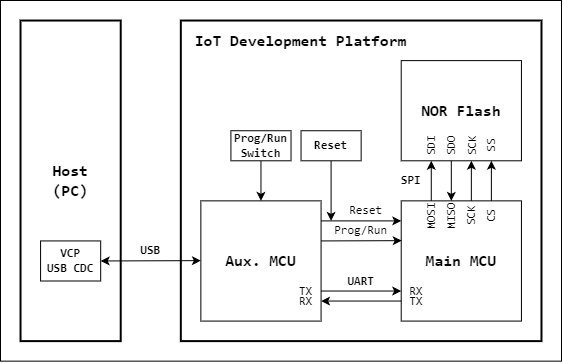
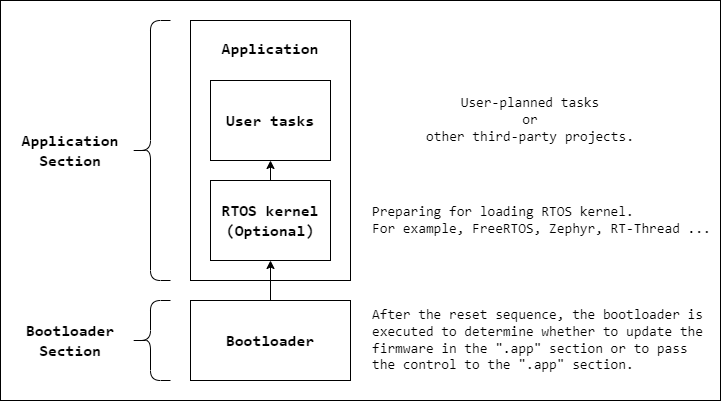
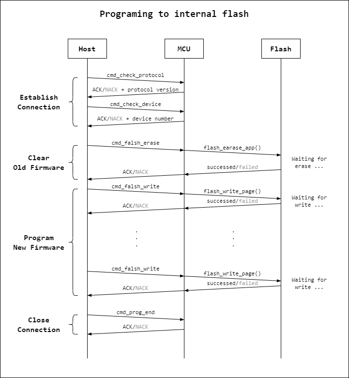
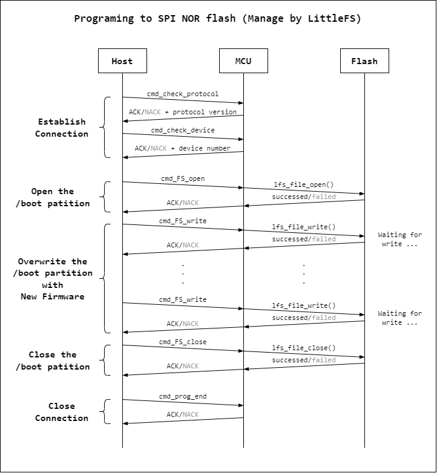
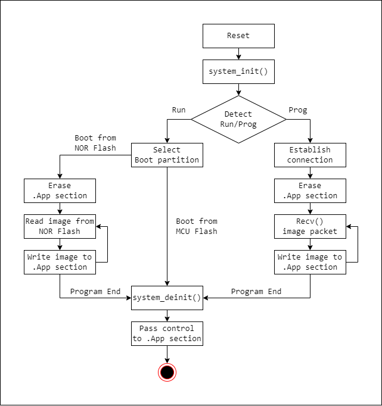

# NuM487BOOT

A serial and secure programming tool for Nuvoton M480 series microcontroller.

## Boot Scheme



## Boot Process



## Software Satck

## Memory Layout

## Communication handshake
### Program the firmware image to the internal flash in MCU.


### Program the firmware image to the external SPI NOR flash manage by LittleFS.


## Communication command
```c
/* bootprotocol commands */
// The control commands
#define CMD_CHK_PROTOCOL            0x01
#define CMD_CHK_DEVICE              0x02
#define CMD_PROG_END                0x03
#define CMD_PROG_EXT_FLASH_BOOT     0x04

// The internal flash associated commands
#define CMD_FLASH_SET_PGSZ          0x10
#define CMD_FLASH_GET_PGSZ          0x11
#define CMD_FLASH_WRITE             0x12
#define CMD_FLASH_READ              0x13
#define CMD_FLASH_VERIFY            0x14
#define CMD_FLASH_ERASE_SECTOR      0x15
#define CMD_FLASH_ERASE_ALL         0x16

// The EEPROM associated commands
#define CMD_EEPROM_SET_PGSZ         0x20
#define CMD_EEPROM_GET_PGSZ         0x21
#define CMD_EEPROM_WRITE            0x22
#define CMD_EEPROM_READ             0x23
#define CMD_EEPROM_VERIFY           0x24
#define CMD_EEPROM_ERASE_SECTOR     0x25
#define CMD_EEPROM_ERASE_ALL        0x26

// The external flash (SPI NOR flash) associated commands
#define CMD_EXT_FLASH_FOPEN         0x30
#define CMD_EXT_FLASH_FCLOSE        0x31
#define CMD_EXT_FLASH_WRITE         0x32
#define CMD_EXT_FLASH_READ          0x33
#define CMD_EXT_FLASH_VERIFY        0x34
#define CMD_EXT_FLASH_ERASE_SECTOR  0x35
#define CMD_EXT_FLASH_HEX_DEL       0x36
```

## Flowchart



## Bootloader packet format
```
 0                   1                   2                   3
 0 1 2 3 4 5 6 7 8 9 0 1 2 3 4 5 6 7 8 9 0 1 2 3 4 5 6 7 8 9 0 1
+-+-+-+-+-+-+-+-+-+-+-+-+-+-+-+-+-+-+-+-+-+-+-+-+-+-+-+-+-+-+-+-+
|                     HEADER                    |    COMMAND    |
+-+-+-+-+-+-+-+-+-+-+-+-+-+-+-+-+-+-+-+-+-+-+-+-+-+-+-+-+-+-+-+-+
|            LENGTH             |                               |
+-+-+-+-+-+-+-+-+-+-+-+-+-+-+-+-+                               +
|                                                               |
+                                                               +
|                     DATA (variable length)                    |
+                                               +-+-+-+-+-+-+-+-+
|                                               |    CHECKSUM   |
+-+-+-+-+-+-+-+-+-+-+-+-+-+-+-+-+-+-+-+-+-+-+-+-+-+-+-+-+-+-+-+-+
```

- HEADER   : 0xA5A5A5
- COMMAND  : See details in the previous intruduction
- LENGTH   : Data length
- DATA     : Variable length
- CHECKSUM : sum(data) % 255

## Bootloader data format

## HOST Tool

ref: <https://github.com/cy023/SerProg>
